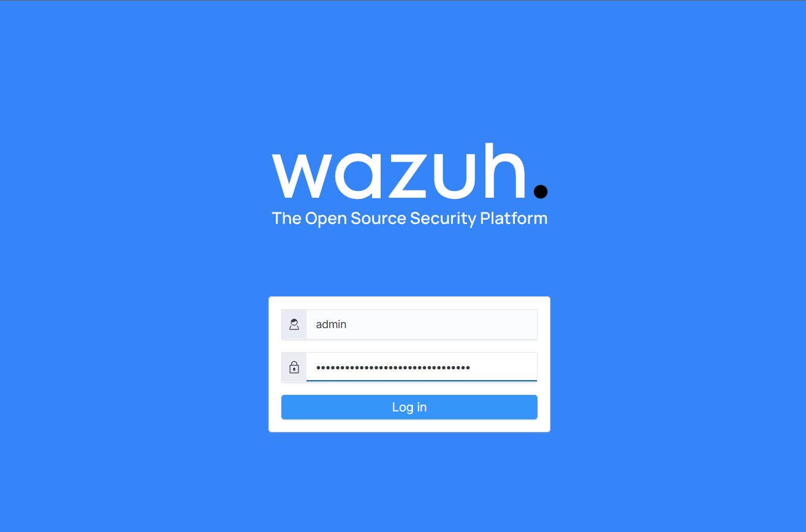
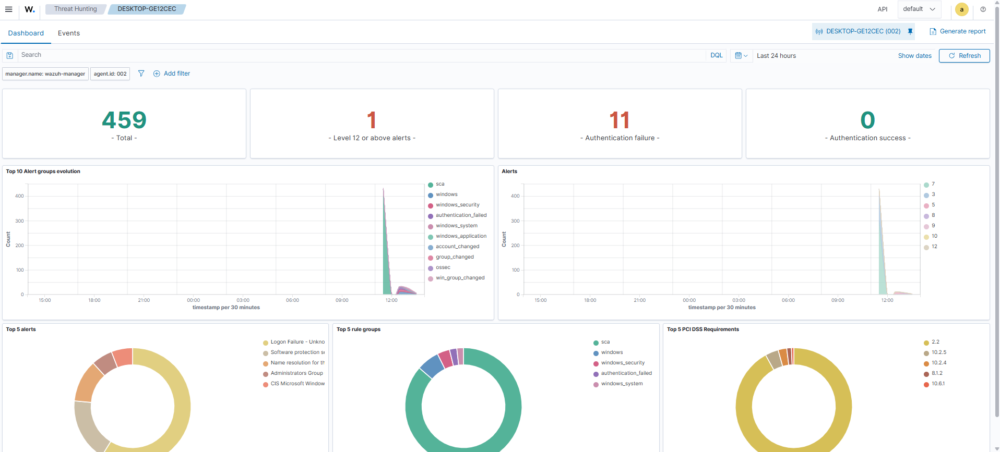
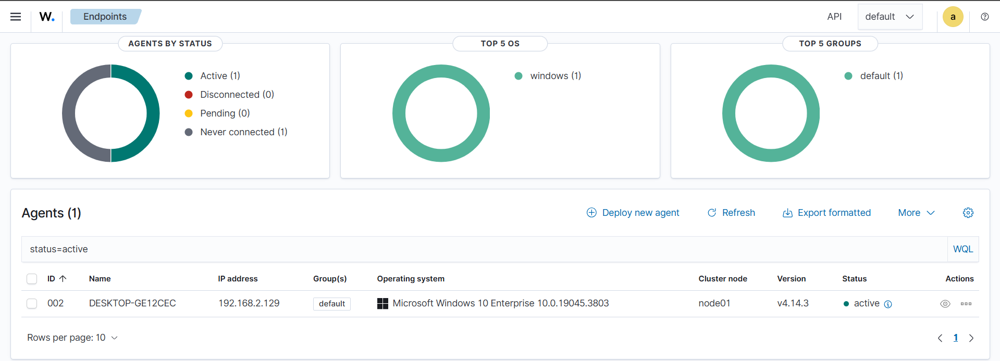
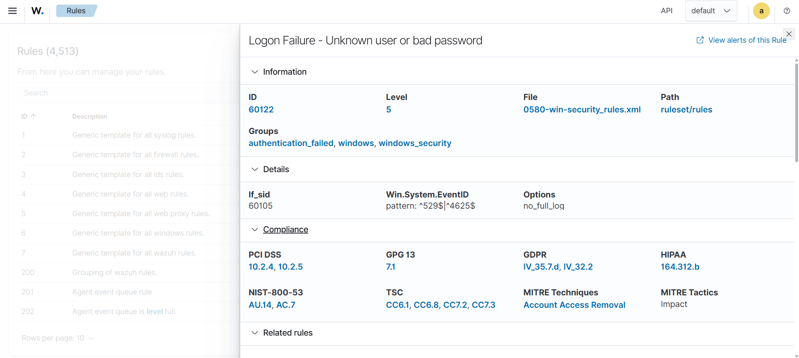
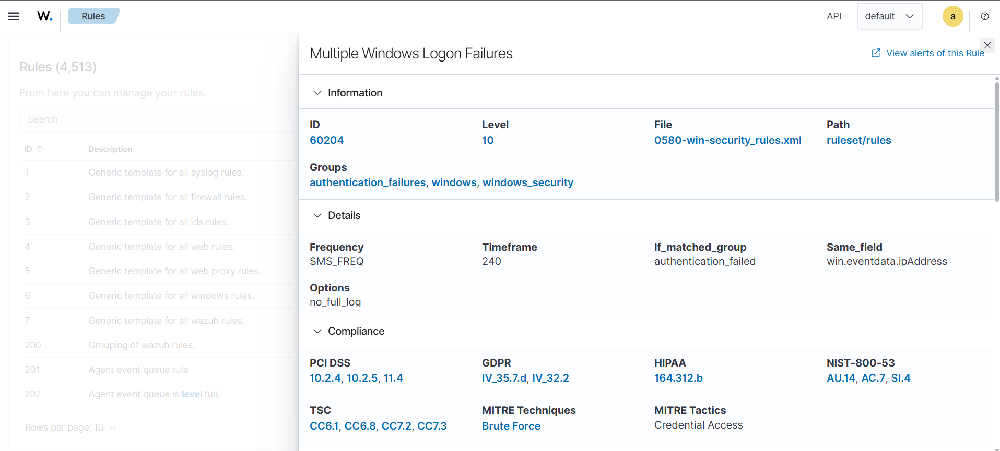
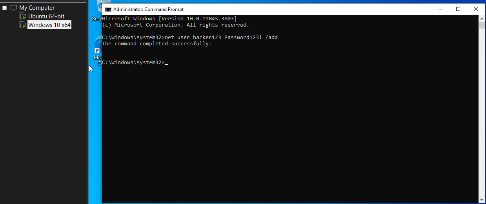
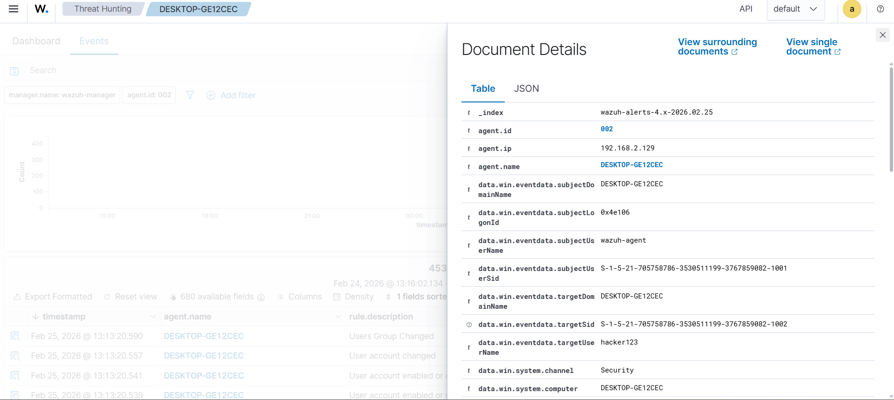
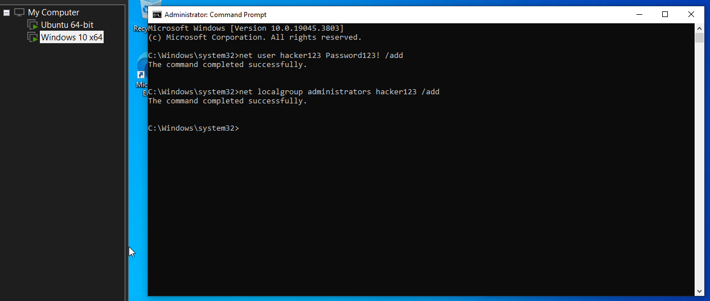
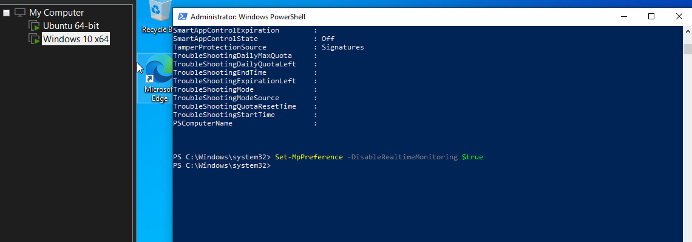
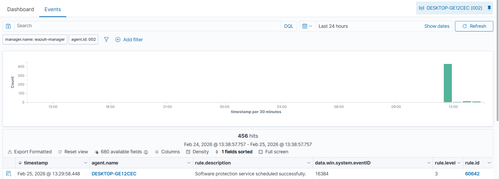

# wazuh-siem-lab
Home SIEM Lab using Wazuh and ELK Stack deployed on VMware. Includes attack simulations, dashboards, and detection analysis.

# Enterprise-Level Home SIEM Lab | Wazuh + ELK Stack

## Overview

This project demonstrates deployment of a Security Information and Event Management (SIEM) system using Wazuh and ELK Stack.

The lab collects, analyzes, and detects security events from Windows and Linux endpoints.

## Lab Architecture

Components:

- Wazuh Manager (Ubuntu Server)
- Elasticsearch
- Kibana Dashboard
- Windows 10 Endpoint with Wazuh Agent
- VMware virtualization

## Tools Used

- Wazuh SIEM
- Elasticsearch
- Kibana
- Ubuntu Server
- Windows 10
- VMware Workstation

## Installation Steps

### Wazuh Server Installation

curl -sO https://packages.wazuh.com/4.14/wazuh-install.sh
sudo bash wazuh-install.sh -a

### Windows Agent Installation

- Download Wazuh Agent
- Install using Manager IP
- Start service

## Attack Simulations

### Failed Login Detection

Command:
runas /user:fakeuser cmd

Detection:
- Security Event ID 4625 detected
- Alert generated in Wazuh dashboard

### Privilege Escalation

net localgroup administrators hacker /add

Detection:
- Admin group modification alert triggered

## Screenshots

### Wazuh Dashboard Overview

### Agent Connected Status

### Alerts Detected

### Login Failed

### Multiple Login attempt

### User Creation

### Privilege Escalation

### PowerShell Execution and Threat Protection

## Dashboard

Shows:
- Failed login attempts
- User creation
- System events
- Security alerts

## Outcome
Successfully built and configured a SIEM lab capable of detecting and alerting on security threats.

## Skills Gained
- SIEM deployment
- Security monitoring
- Threat detection
- Log analysis
- Incident detection
- Wazuh configuration

## Author
Abubakar Siddiq
